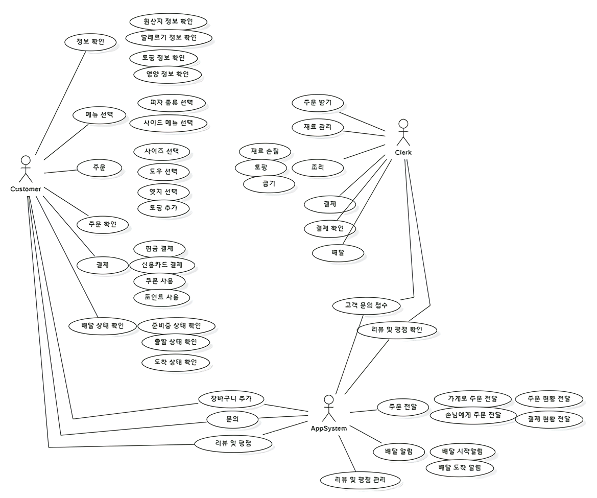
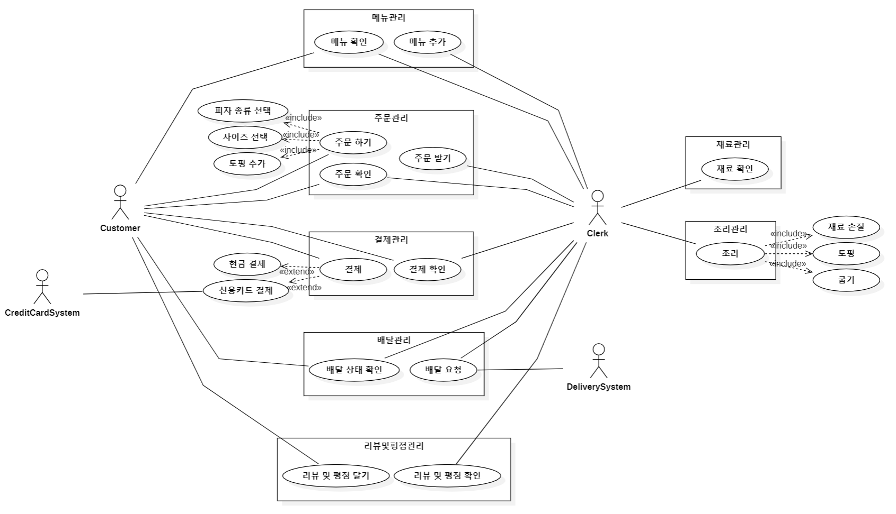

# Analysis  

- Outline  
: figure out `System requirments` with brain-stoming, and sort out them into `7 categories`  
-> draw a `Usecase Diagram`  

---

### System requirements  
: rough draft

> | Customer | | Employee | | App System | |  
> | :-- | :-- | :-- | :-- | :------- | :-- |  
> | 1. 메뉴 선택 | 피자 종류 | 1. 주문 받기 | | 1. 주문 전달 | 주문현황 전달 결제현황 전달 |  
> | 2. 정보 확인 | 원산지 정보 알레르기 정보 토핑 정보 영양 정보 | 2. 재료 관리 | | 2. 주문 확인 전달 | |  
> | 3. 주문 | 사이즈 선택 도우 선택 엣지 선택 토핑 추가 | 3. 피자 조리 | 재료 손질 토핑 굽기 | 3. 배달 알림 | 배달시작 알림 배달도착 알림 | |  
> | 4. 장바구니 | | 4. 결제 | 결제 확인 | 4. 리뷰 및 평점 관리 | |  
> | 5. 결제 | 현금 결제 신용카드 결제 쿠폰 결제 포인트 결제 | 5. 배달 | | | |  
> | 6. 주문 확인 | | 6. 고객 문의 받기 | | | |  
> | 7. 배달 상태 확인 | 준비중 출발 도착| 7. 리뷰 & 평점 확인 | | | |  
> | 8. 문의하기 | | | | | |  
> | 9. 리뷰 & 평점 작성 | | | | | |  

---

### Category  

1. **메뉴 관리** (Menu management)  
    - 메뉴확인  
    - 메뉴추가  

2. **주문 관리** (Order management)  
    - 주문하기
    - 주문받기
    - 주문확인  

3. **결제 관리** (Payment management)  
    - 결제하기
    - 결제확인

4. **배달 관리** (Delivery management)  
    - 배달요청
    - 배달상태 확인

5. **리뷰 & 평점 관리** (Review & Rating management)  
    - 리뷰 & 평점 달기
    - 리뷰 & 평점 확인

6. **재료 관리** (Ingredients management)  
    - 재료 확인

7. **조리 관리** (Cooking management)  
    - 조리  

---

### Usecase Diagram  

- Rough Draft  
   

- Final  
  