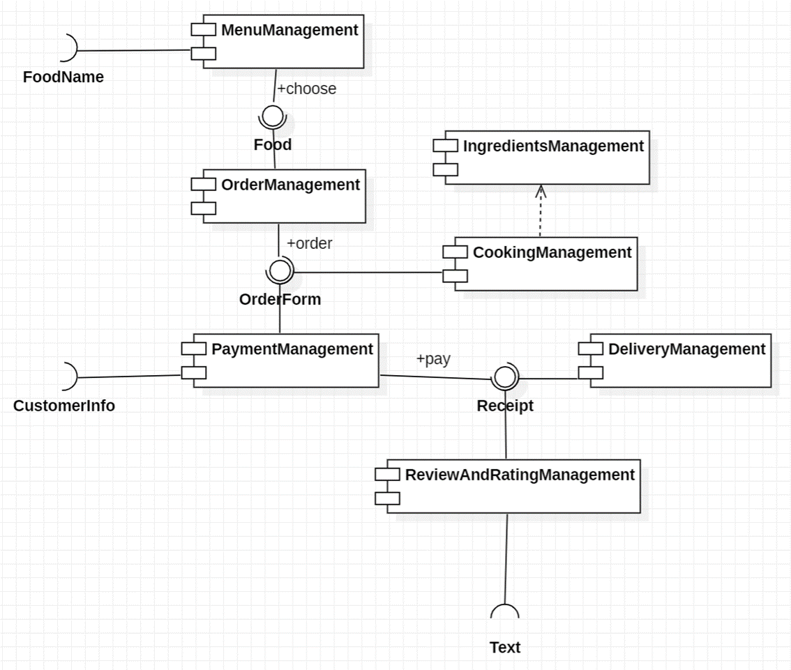

# Design  

- Outline  
: design [Component Diagram](#component-diagram), [Class Diagram](#class-diagram)    

---

### Component Diagram  
  

1. **Access** via 3 external interfaces (FoodName, CustomerInfo, Text)  
2. can **Replace** component with component that implements same interface  

### Class Diagram